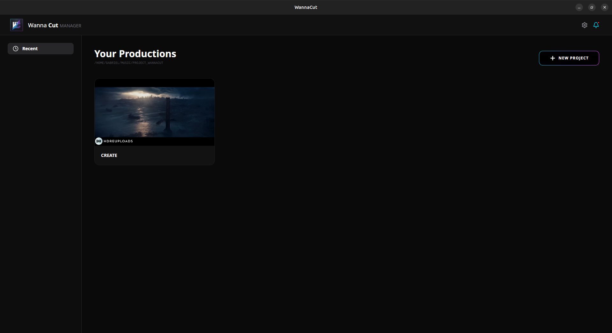
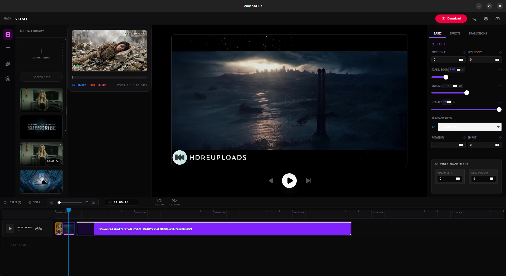
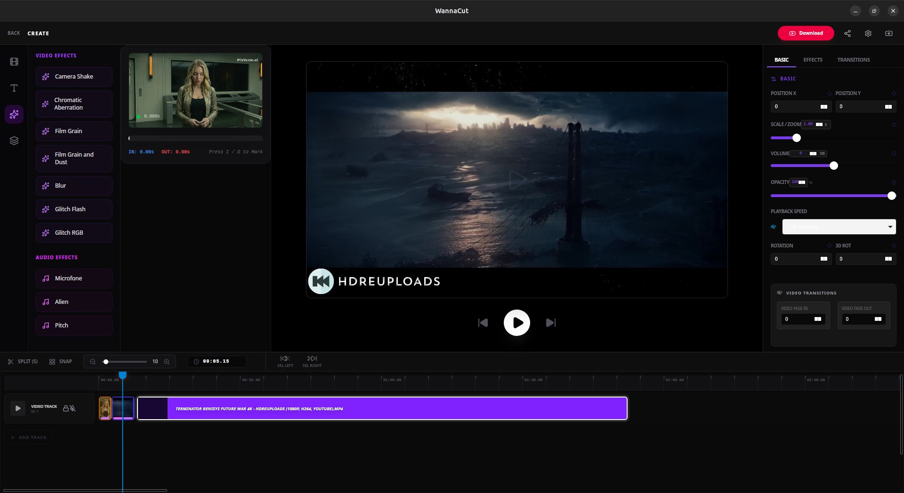

# 🚀 WannaCut - Professional Open Core Video Editor

**WannaCut** is a high-performance, lightweight video editor built for the modern creator. Combining the safety of **Rust** (Tauri) with the flexibility of **React**, it offers a professional-grade timeline experience without the bloat of traditional editors.

**This is Free CapCut available for Linux and Windows. More complete than other projects in the community: So give a star to the project if you like.** **I am accepting recommendations**

  

  

### **Status:** 🛠️ _Version 0.3.0_ **Under Development ❗❗❗** _(Beta)_

----------

## 📸 Project Glimpse

**Project Manager**

**Professional Timeline**

**Clips's Context Menu and Keyframes**

**Fadein and out:**

**Effects for video and audio:**

----------

## ✨ Current Features

-   [x] **Smart Project Manager:** Workspace-based file system to organize all your productions.
    
-   [x] **Multi-Track Timeline:** Resizable and vertical-scrolling timeline with dynamic track management.
    
-   [x] **Pro Playback System:** `requestAnimationFrame` driven playhead with sub-second timecode precision.
    
-   [x] **Infinite History (100+ Steps):** Robust Undo/Redo system protecting your creative process.
    
-   [x] **Intelligent Manipulation:**
    
    -   Precision **Split (S)** tool.
    -   Multi-select clips and assets for bulk actions.
    -   **Magnetic Snapping:** Magnetic timeline for perfect alignment.

-   [x] **Easy Fadein and Out:** Easy Fade In and Out (for video and audio) moving the corners of the clips.
        
-   [x] **Scale Controls:** Dynamic zoom (Ctrl/Alt + Scroll) and resizable UI panels.
    
-   [x] **Asset Purge:** Automatic cleaning of unused tracks to keep the workspace optimized.

-   [x] **Separate Audio:** Separate or Recover Audio with one click.

-   [x] **Keyframable Volume, Opacity and Speed:** Change Volume, Speed and Opacity using Keyframes. Keyframes that are not speed-related automatically sync with the time distortion caused by speed adjustments.

-   [x] **Sub-clips:** Create subclips before importing them into the project.

-   [x] **Web Media Linker:** Quick network integration to stream or fetch cloud-stored public video links directly into your active project timeline.

-   [x] **Drag & Drop Trimming:** Resizing clips directly on the timeline edges.
    
-   [x] **Audio Waveforms:** Visual representation of audio tracks for sync.
    
-   [x] **Export Engine:** Native rendering via MoviePy.
    
-   [x] **Transition Library:** Fade-ins, cuts, and visual effects.    

-   [x] **Silent Notification System:** A system of notifications that appears only when you click on the bell (_right corner_).

-   [x] **Video and Audio effects:** Video effects like Glitch RGB, Camera Shake, Blur, and Audio Effects like Microphone and Alien.

-   [x] **Smart Edge Navigation:** Dedicated shortcuts to instantly jump between clip edges (edit points) for fast timeline traversal.

----------

## 🛠️ Built With

-   **Tauri:** High-performance desktop framework.
-   **React + TypeScript:** For a type-safe and reactive UI.
-   **Tailwind CSS:** Professional-grade styling.
-   **Lucide React:** Beautiful and consistent iconography.
-   **Framer Motion:** Smooth transitions and UI feedback.

----------

### 💻 Installation

Just go to the [WannaCut Website](https://wannacut.app) and follow the instructions.

#### 🛠️ NEED HELP

> Need help or want to report bugs? [Join our Reddit Community](https://www.reddit.com/r/WannaCut/)
>
> Want to learn how to use WannaCut? [Watch our YouTube Channel](https://www.youtube.com/@WannaCutVideoEditor)

----------

## 🗺️ Roadmap (Upcoming Features)

-   [ ] **Mask:** Advanced shape masking (Rectangle, Circle, and Custom paths) with real-time hardware-accelerated feathering and opacity control.
    
-   [ ] **Transitions:** Smooth, dynamic video and audio transitions (Fade, Cross Dissolve, Slide, and Zoom) with full duration customization directly on the timeline edges.

----------

## ⚖️ License

WannaCut is open-core software licensed under the **GNU AGPLv3**.